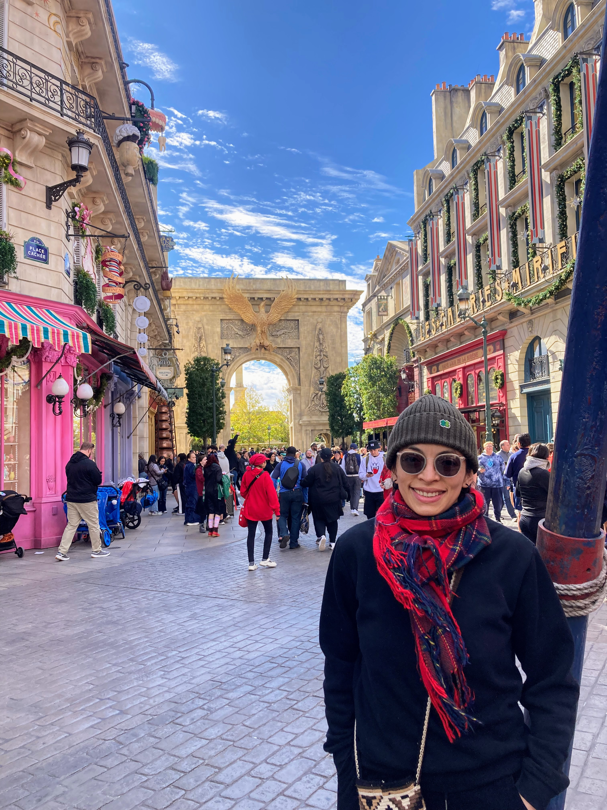

### About

  
   

  Dr. Greis J. Kim Reyes

  

I am an Assistant Professor of Physics in the Physics and Astronomy Department at SUNY New Paltz, and my research focuses on studying materials using computational techniques. In addition, I am passionate about teaching and combine my lectures with simulations and many problem-solving sessions.

[Simplified CV](cv.md)

[🏠 Home](index.md)
