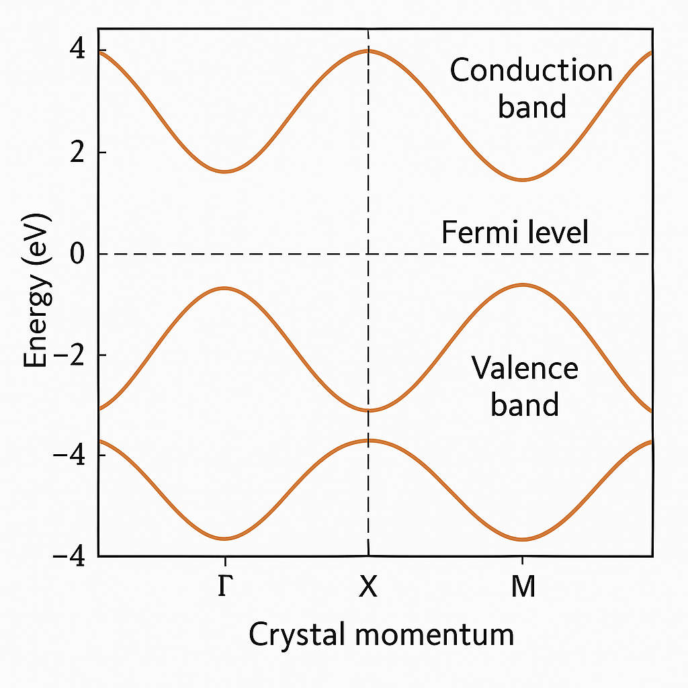

# Electronic Structure Calculations

Electronic structure calculations form the foundation of computational materials science, enabling the prediction and analysis of a material’s electronic properties. Utilizing density functional theory (DFT) and related methods, these calculations provide insights into wave functions, energy levels, and electron distributions, offering a detailed understanding of metallic, insulating, and semiconducting behaviors.

## Density Functional Theory (DFT)

* DFT as the most widely used approach.

* Instead of solving the many-body Schrödinger equation directly, DFT leverages functionals of the electron density to approximate the ground-state properties.

* In Kohn-Sham Density Functional Theory (DFT), the complex many-electron system is approximated by a fictitious system of non-interacting electrons moving in an effective potential, designed to reproduce the exact ground-state electron density of the real, interacting system.

* Common approximations include the Local Density Approximation (LDA) and Generalized Gradient Approximation (GGA), though more advanced methods, such as hybrid functionals, are sometimes employed for improved accuracy.

Using methods like the **tight-binding model** and **density functional theory (DFT)**, researchers can study:
- Band structures and energy levels.
- Magnetic and optical properties.
- Interactions between electrons and atoms.

These tools are critical for designing new materials for applications in electronics, energy, and nanotechnology.

[Back to Home](index.md)