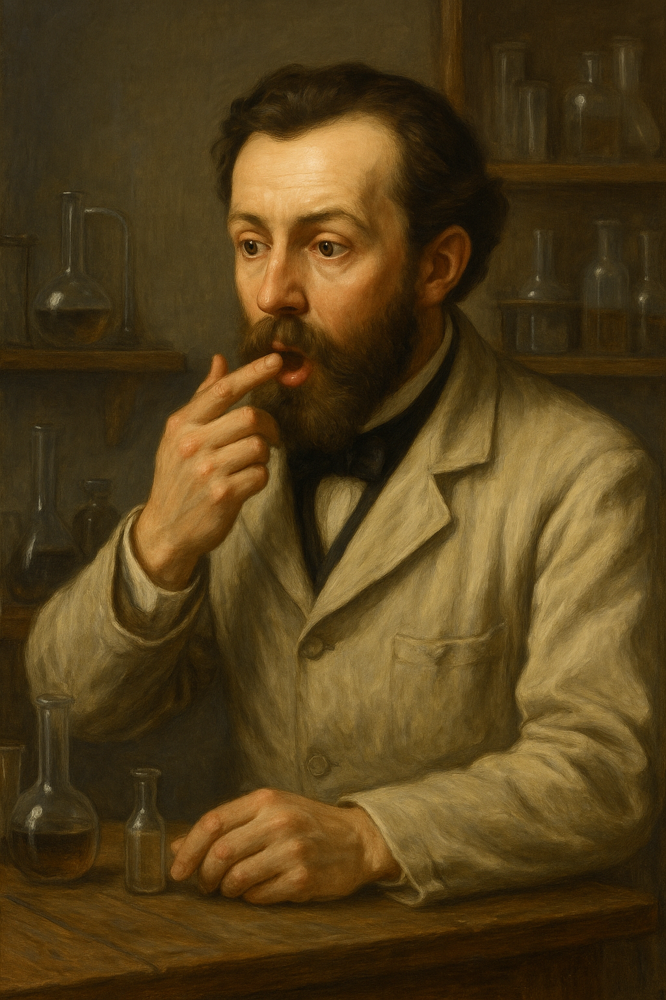

## Welcome!

The study and design of materials form the backbone of modern technology. The extensive effort and meticulous attention to detail in every device we use daily represent a remarkable journey of exploration, research, and calculations with, sometimes, intriguing origins.

    

        
Many essential materials have been discovered by <b>chance</b>. For instance, <b>saccharin</b> was accidentally found in 1879 by Constantine Fahlberg when he noticed a sweet taste on his hands after handling coal tar derivatives. 
        Similarly, Roy Plunkett, a chemist at DuPont, discovered polytetrafluoroethylene (PTFE), later known as <b>Teflon</b>b>, in 1938 while researching refrigerants. And how to forget the first Nobel Prize in Physics: <b>X-rays</b>, which Wilhelm Roentgen, a German physicist, stumbled upon in 1895 during experiments with cathode ray tubes.

    

    

        
        

            
Fahlberg imagined by ChatGPT.

        

    

 
While these histories evoke admiration due to their roots in genuine curiosity and consistent work, today, a vast field of opportunities has emerged through computational techniques. <b>First-principle Methods</b> enable us to simulate the electronic behavior, optical response, and stability of material prototypes for various applications that are projected to meet contemporary technological needs. Even more recently, <b>Machine Learning</b> techniques have transformed the landscape of materials search by predicting a significant number of prototype materials capable of optimizing and launching a new way to find new materials. This website aims to introduce undergraduate students to solid state calculations, requiring them to understand physics, acquire computational techniques, engage in critical analysis, and cultivate curiosity about new ways of discovering materials.

#### Solid-State Calculations at a Glance

* [Electronic Structure Calculations](./electronic-structure.md).
* [Probing Lattice Dynamics](./phonons.md).
* [Spin-Polarized Calculations](./spin-polarized.md).

* * *

### About

Dr. Greis J. Kim Reyes

 I am an Assistant Professor of Physics in the Physics and Astronomy Department at SUNY New Paltz, and my research focuses on studying materials using computational techniques. These techniques allow us to simulate the electronic behavior, optical response, and stability of material prototypes for various applications that meet current technological needs. In addition, I am passionate about teaching and combine my lectures with simulations and many problem-solving sessions.

* [Simplified CV](./cv.md).

* * *

### Research

My research objectives are centered on understanding and predicting the properties of materials from first principles. This includes a concerted effort to investigate advanced semiconductor materials, particularly intermediate band semiconductors, perovskites, to explore their unique electronic properties and potential applications. Additionally, I seek to examine defects in solids, which play a critical role in determining material behavior, and to study magnetic materials using density functional theory.

* [Google Scholar Profile](https://scholar.google.com/citations?user=R3wN1y8AAAAJ&hl=en).

* * *

### Teaching

Teaching is one of my greatest passions. Over the years, I’ve had the privilege of teaching various courses, from introductory physics to quantum mechanics. My teaching philosophy emphasizes clarity and engagement. I strive to create an interactive learning environment where students feel encouraged to ask questions, think critically, and explore the world of physics. For instance, my Quantum Physics course has been introduced alongside the use of Mathematica, which I believe will help students develop the new physics intuition required for analyzing quantum materials.

| Year        | Course         | Credits |
|:-------------|:------------------|:------|
| Fall 2024    | General Physics 1 | 3     |
|              | Quantum Physics   | 3     |
| Spring 2025  | General Physics 1 | 3     |
|              | General Physics Lab 2 | 1 |
| Fall 2025    | General Physics 1 | 3     |
|              | Quantum Physics   | 3     |
|              | General Physics Lab 2 | 1 |

### Contact
<dl>
<dt>Email:</dt>
<dd>kimreyesg@newpaltz.edu</dd>
<dt>Office:</dt>
<dd>State University of New York at New Paltz</dd>
<dd>Physics and Astronomy Department</dd>
<dd>Science Hall 275</dd>
<dt>Phone:</dt>
<dd>(845) 257-3734</dd>
</dl>

