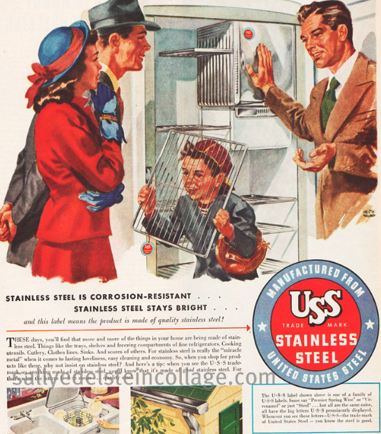

<nav>
  <a href="/">Home</a> |
  <a href="/about.html">About</a> |
  <a href="/teaching.html">Teaching</a> |
  <a href="/research.html">Research</a> |
  <a href="/contact.html">Contact</a> |
</nav>

---

<!DOCTYPE html>
<html lang="en">
<head>
  <meta charset="UTF-8" />
  <meta name="viewport" content="width=device-width, initial-scale=1.0"/>
  <title>Accidental Discoveries in Materials Science</title>
  
</head>
<body>
  <h1>Accidental Discoveries & Modern Materials Science</h1>

  

    

      <h2>The Journey of Materials</h2>
      

        The study and design of materials form the backbone of modern technology. The extensive effort and meticulous attention to detail in every device we use daily represent a remarkable journey of exploration, research, and calculations with, sometimes, intriguing origins.
      

    

    

      <h2>Happy Accidents</h2>
      

        Many essential materials have been discovered by chance. For instance, saccharin was found in 1879 by Fahlberg when he noticed a sweet taste on his hands after handling coal tar derivatives.
      

      

        Similarly, Roy Plunkett, a chemist at DuPont, discovered Teflon in 1938 while researching refrigerants.
      

      

        Left to right: Jack Rebok, Robert McHarness, and Roy Plunkett
      

    

    

      <h2>Birth of Stainless Steel</h2>
      

        Brearley experimented with steel alloys to make more erosion-resistant gun barrels. He created a steel with about 12% chromium, and later noticed that a discarded sample hadn’t rusted, unlike others. This accidental observation led to the birth of stainless steel.
      

      

        Stainless steel revolutionized modern society.
      

    

    

      <h2>Computational Materials Science</h2>
      

        While these histories evoke admiration due to their roots in genuine curiosity and consistent work, today, a vast field of opportunities has emerged through computational techniques. First-principle Methods enable us to simulate electronic behavior, optical response, and stability of material prototypes for various applications projected to meet contemporary technological needs.
      

    

    

      <h2>Mach

# Welcome!

The study and design of materials form the backbone of modern technology. The extensive effort and meticulous attention to detail in every device we use daily represent a remarkable journey of exploration, research, and calculations with, sometimes, intriguing origins.

Many essential materials have been discovered by <b>chance</b>. For instance, <b>saccharin</b> was found in 1879 by Fahlberg when he noticed a sweet taste on his hands after handling coal tar derivatives. Similarly, Roy Plunkett, a chemist at DuPont, discovered <b>Teflon</b> in 1938 while researching refrigerants.

  
   
  Left to right: Jack Rebok, Robert McHarness, and Roy Plunkett

Brearley experimented with steel alloys to make more erosion-resistant gun barrels. He created a steel with about 12% chromium, and later noticed that a discarded sample hadn’t rusted, unlike others. This accidental observation led to the birth of <b>stainless steel</b>.

        

  
   
  Stainless steel revolutionized modern society.

 
While these histories evoke admiration due to their roots in genuine curiosity and consistent work, today, a vast field of opportunities has emerged through computational techniques. <b>First-principle Methods</b> enable us to simulate the electronic behavior, optical response, and stability of material prototypes for various applications projected to meet contemporary technological needs. Even more recently, <b>Machine Learning</b> techniques have transformed the landscape of materials search by predicting many prototype materials capable of optimizing and launching a new way to find new materials. This website aims to introduce undergraduate students to solid state calculations, requiring them to understand physics, acquire computational techniques, engage in critical analysis, and cultivate curiosity about new ways of discovering materials.

 

## Latest from Nature Materials

<a class="twitter-timeline"
   data-height="600"
   data-theme="light"
   href="https://twitter.com/NatureMaterials?ref_src=twsrc%5Etfw">
  Tweets by NatureMaterials
</a>

