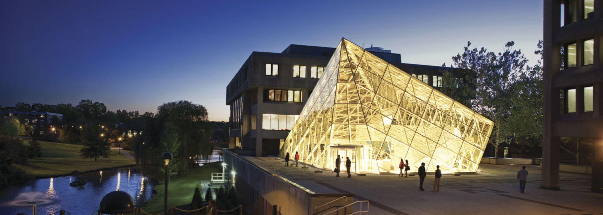

# Computational Solid State Physics

  

 NaCl, Sodium Chloride Crystal Structure 🧂

Have you ever wondered why your smartphone works, how solar panels capture energy, or what makes some materials magnetic? Solid-state and materials science holds answers. This exciting field explores how atoms arrange themselves in materials and how these arrangements create the properties we see and use every day. 

These computer simulations let scientists "test drive" materials before making them in a lab, saving time and resources. It's like being able to design and test a car completely in a computer game before building it in real life. The knowledge from this field directly impacts technology you use daily—from the chips in your laptop to the materials in your bike frame to the screen you're reading this on right now.

## Overview

* [Electronic Structure Calculations](./electronic-structure.md).

* * *

### About

Dr. Greis J. Kim Reyes

I am Assistant Professor of Physics in the Physics and Astronomy Department at SUNY New Paltz, and my research focuses on studying materials using computational techniques. These techniques allow us to simulate the electronic behavior, optical response, and stability of material prototypes for various applications that meet current technological needs. In addition, I am passionate about teaching and combine my lectures with simulations and many problem-solving sessions.

* * *

### Research

+ My research focuses on data-driven techniques to address critical challenges in materials science. These techniques are applied to several key areas, including sustainable energy storage and generation systems, catalytic materials, perovskites, defects in semiconductors, and next-generation semiconductors.

#### Recent Research:

    

        <strong>Giant Narrow-Band Optical Absorption and Distinctive Excitonic Structures of Monolayer C3N and C3B</strong> 
        Z. Tang, G. J. Cruz, Y. Wu, W. Xia, F. Jia, W. Zhang, P. Zhang - <em>Physical Review Applied</em>, 2022
    

    

        <strong>Giant Excitonic Effects in Vacancy-Ordered Double Perovskites</strong> 
        F. Zhang, W. Gao, G. J. Cruz, Y. Sun, P. Zhang, J. Zhao - <em>Physical Review B</em>, 2023
    

    

        <strong>Quasiparticle Band Structures of the 4d Perovskite Oxides SrZrO3 and BaZrO3</strong> 
        G. Lopez-Candales, Z. Tang, G. J. Cruz, W. Xia, F. Jia - <em>Physical Review B</em>, 2021
    

[Google Scholar Profile](https://scholar.google.com/citations?user=R3wN1y8AAAAJ&hl=en)

* * *

### Teaching

Teaching is one of my greatest passions. I believe that education is a two-way street where I not only share knowledge but also learn from my students' unique perspectives and insights. Over the years, I have had the privilege of teaching a variety of courses in English, ranging from introductory physics to quantum mechanics. My teaching philosophy emphasizes clarity, engagement, and the integration of real-world applications to make complex concepts accessible and relatable. I strive to create an interactive learning environment where students feel encouraged to ask questions, think critically, and explore the fascinating world of physics.

| Year        | Course         | Credits |
|:-------------|:------------------|:------|
| Fall 2024    | General Physics 1 | 3     |
|              | Quantum Physics   | 3     |
| Spring 2025  | General Physics 1 | 3     |
|              | General Physics Lab 2 | 1 |
| Fall 2025    | General Physics 1 | 3     |
|              | Quantum Physics   | 3     |
|              | General Physics Lab 2 | 1 |

### Contact
<dl>
<dt>Email:</dt>
<dd>kimreyesg@newpaltz.edu</dd>
<dt>Office:</dt>
<dd>State University of New York at New Paltz</dd>
<dd>Physics and Astronomy Department</dd>
<dd>Science Hall 275</dd>
<dt>Phone:</dt>
<dd>(845) 257-3734</dd>
</dl>

