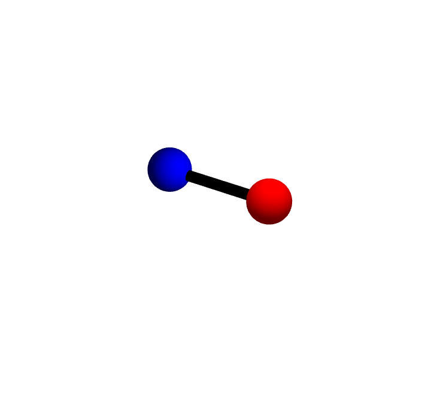

# Probing Lattice Dynamics

Phonon calculations probe the vibrational properties of a crystal by computing its normal modes across the Brillouin zone. These calculations reveal dynamic stability, thermal properties, and potential structural phase transitions.

  

 A vibrational mode of a diatomic molecule

### Harmonic Approximation

To assess a system's stability, one generates phonon dispersion spectra by first expanding the total energy as a second-order Taylor series around atomic equilibrium positions, then calculating the forces produced by small atomic displacements (via finite differences or DFPT), and finally constructing and diagonalizing the dynamical matrix to find the eigenvalues (ω²) at each k-point - employing either supercell methods with explicit atomic displacements or more efficient linear-response calculations using density-functional perturbation theory within the primitive cell.