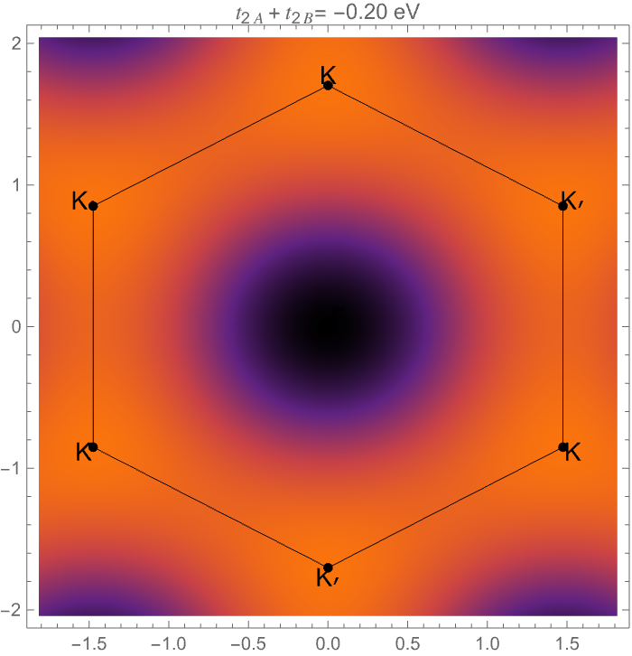

# Research

  <!-- Left: text -->
  

    

      I focus on understanding and engineering semiconductor materials, with an emphasis on intermediate band semiconductors.
      My work investigates how their electronic structure and defect physics shape key properties, and how those insights can enable
      device-relevant applications. In parallel, I study defects in solids and explore magnetic materials, linking atomic-scale imperfections
      to measurable electronic and magnetic behavior.
    

  

  <!-- Right: button + image -->
  

    <a href="https://scholar.google.com/citations?user=R3wN1y8AAAAJ&hl=en"
       target="_blank"
       style="
          display:inline-block;
          background-color:#00CCBB;
          color:#ffffff;
          padding:10px 20px;
          text-decoration:none;
          font-weight:bold;
          border-radius:10px;
          font-family:sans-serif;
          margin-bottom:12px;
       ">
       Google Scholar
    </a>

  

# Undergraduate Research in Physics 2025

  <!-- Text -->
  

    <h2 style="margin-top:0;">Calibrating Tight Binding for Biaxially Strained Graphene</h2>
    <h3 style="margin-top:0;">Jillian Iqbal</h3>

  Department of Physics and Astronomy, SUNY New Paltz

  <!-- Image -->

  

    

      We study the effect of uniform biaxial strain on monolayer graphene using a minimal tight binding model
      with nearest and next-nearest neighbor hopping. A constant-hopping parametrization fails to match
      experimental trends, so we introduce a distance-dependent hopping of exponential form, which improves
      the strain dependence of low-energy observables over a realistic strain range.
    

    <!-- Links -->
    

      <a href="assets/posters/Biaxial_Strain_Graphene_poster.pdf"
         style="display:inline-block; padding:10px 14px; border-radius:10px; text-decoration:none;
                background:#003E7E; color:white; font-weight:700;">
        Poster (PDF)
      </a>

      <a href="assets/code/Biaxial-Strain-JI-GK.nb"
         style="display:inline-block; padding:10px 14px; border-radius:10px; text-decoration:none;
                background:#F58426; color:white; font-weight:700;">
        Code (Wolfram Language (Mathematica) Notebook)
      </a>
    

  

  <!-- Text -->
  

    <h2 style="margin-top:0;">Heatmaps of NNN-Driven Asymmetry in Graphene</h2>
    <h3 style="margin-top:0;">Flavio Loja</h3>

  Department of Chemistry, SUNY New Paltz

  <!-- Image -->

  

    

We investigate electron–hole asymmetry in monolayer graphene using a
minimal-band tight-binding model that adds Next-Nearest-Neighbor
(NNN) hopping to the standard nearest-neighbor Hamiltonian. While
NN hopping alone yields particle–hole symmetry and a Dirac crossing at
charge neutrality, a finite NNN term preserves the gapless crossing but
shifts the neutrality point and skews band curvatures across the Brillouin
zone. We quantify these effects with two complementary outputs: (i)
band overlays along Γ–K–M–Γ that show the Dirac crossing moving
rigidly with the NNN term and the loss of spectral mirror symmetry;
and (ii) a Brillouin-zone “asymmetry map,” defined as the sum of the
conduction and valence energies, which visualizes a six-fold pattern tied
to lattice geometry.
    

    <!-- Links -->
    

      <a href="assets/posters/Biaxial_Strain_Graphene_poster.pdf"
         style="display:inline-block; padding:10px 14px; border-radius:10px; text-decoration:none;
                background:#003E7E; color:white; font-weight:700;">
        Poster (PDF)
      </a>

      <a href="assets/code/Graphene-TB-NNN-flavio.nb"
         style="display:inline-block; padding:10px 14px; border-radius:10px; text-decoration:none;
                background:#F58426; color:white; font-weight:700;">
        Code (Wolfram Language (Mathematica) Notebook)
      </a>
    

  

[🏠 Home](index.md)
