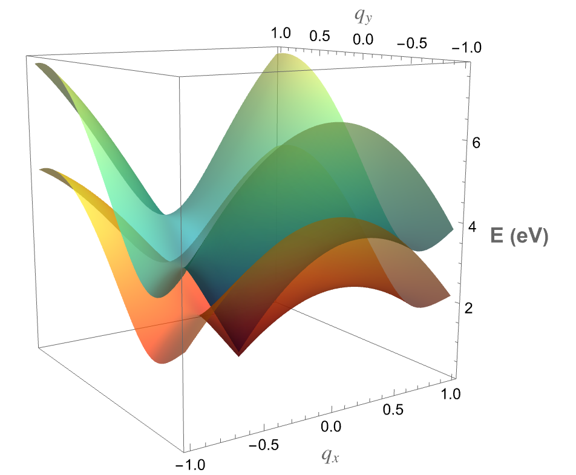

# Research

I focus on understanding and engineering semiconductor materials, with an emphasis on intermediate band semiconductors. My work investigates how their electronic structure and defect physics shape key properties, and how those insights can enable device-relevant applications. In parallel, I study defects in solids and explore magnetic materials, linking atomic-scale imperfections to measurable electronic and magnetic behavior.

  <a href="https://scholar.google.com/citations?user=R3wN1y8AAAAJ&hl=en"
     target="_blank"
     style="
        display: inline-block;
        background-color: #00CCBB;
        color: #ffffff;
        padding: 10px 20px;
        text-decoration: none;
        font-weight: bold;
        border-radius: 5px;
        font-family: sans-serif;
     ">
     Google Scholar
  </a>

  

## Undergraduate Research
### Undergraduate Research in Physics 2025

  <!-- Image -->
  

    
  

  <!-- Text -->
  

    <h3 style="margin-top:0;">Calibrating Tight Binding for Biaxially Strained Graphene</h3>

    

      We study the effect of uniform biaxial strain on monolayer graphene using a minimal tight binding model
      with nearest and next-nearest neighbor hopping. A constant-hopping parametrization fails to match
      experimental trends, so we introduce a distance-dependent hopping of exponential form, which improves
      the strain dependence of low-energy observables over a realistic strain range.
    

    <!-- Links -->
    

      <a href="assets/posters/Biaxial_Strain_Graphene_poster.pdf"
         style="display:inline-block; padding:10px 14px; border-radius:10px; text-decoration:none;
                background:#003E7E; color:white; font-weight:700;">
        Poster (Portable Document Format (PDF))
      </a>

      <a href="assets/code/Biaxial-Strain-JI-GK.nb"
         style="display:inline-block; padding:10px 14px; border-radius:10px; text-decoration:none;
                background:#F58426; color:white; font-weight:700;">
        Code (Wolfram Language (Mathematica) Notebook)
      </a>
    

  

[🏠 Home](index.md)
