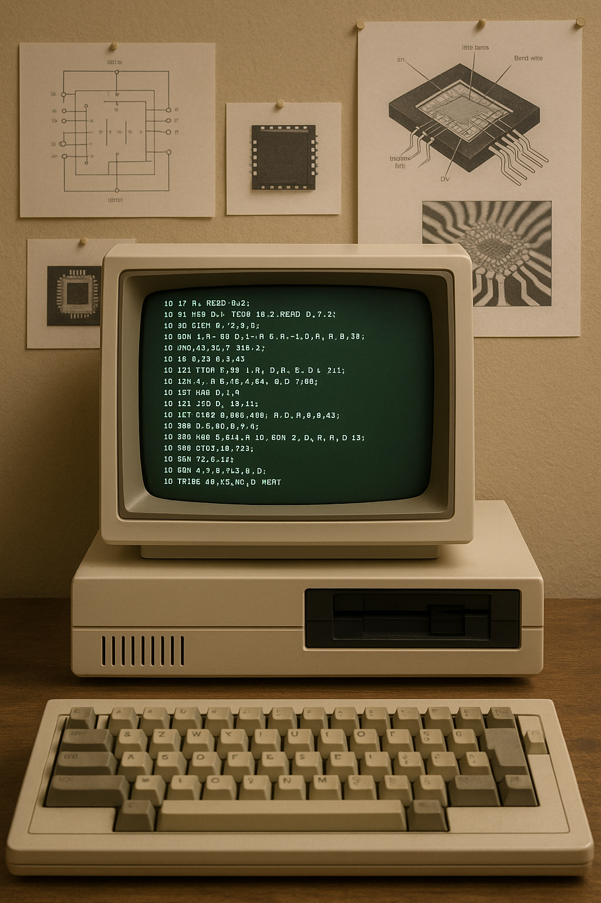

# Research

I am dedicated to investigating semiconductor materials, particularly intermediate band semiconductors, to understand their electronic properties and explore their potential applications. Additionally, I am interested in studying defects in solids and magnetic materials.

## Undergraduate Research
### Undergraduate Students Fall 2025

<a href="https://scholar.google.com/citations?user=R3wN1y8AAAAJ&hl=en" 
   target="_blank" 
   style="
      display: inline-block;
      background-color: #00CCBB;
      color: #ffffff;
      padding: 10px 20px;
      text-decoration: none;
      font-weight: bold;
      border-radius: 5px;
      font-family: sans-serif;
      margin: 10px 0;
   ">
   Google Scholar
</a>

[🏠](index.md)
